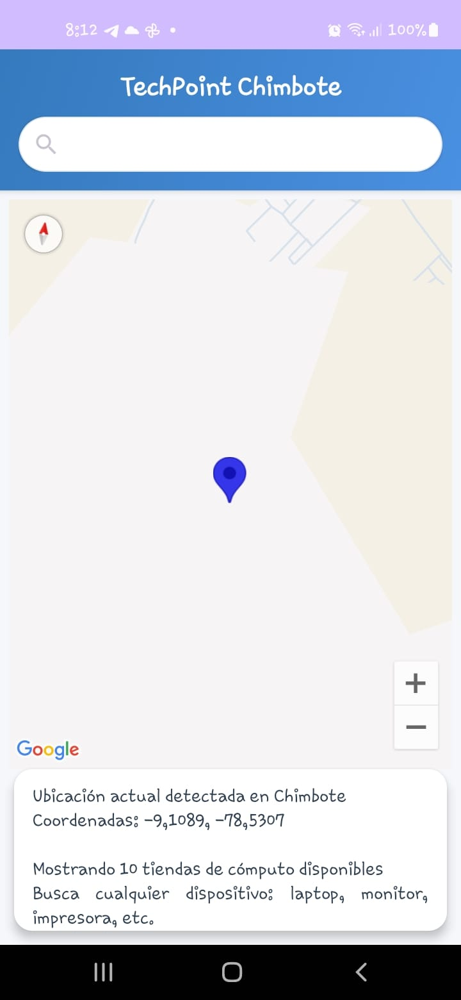
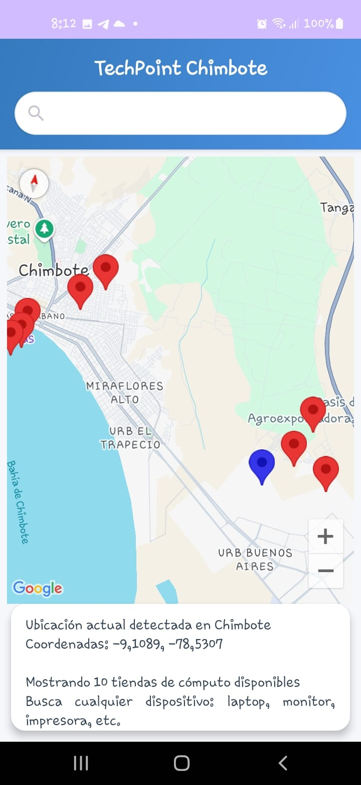
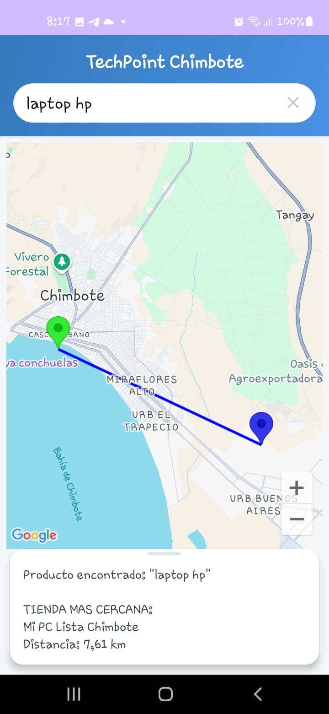
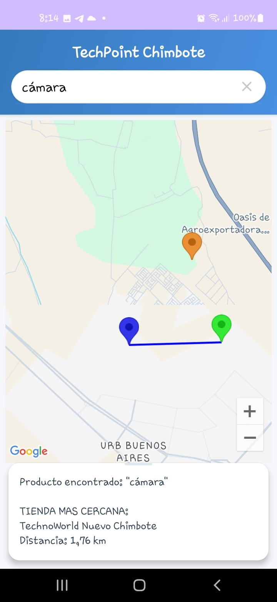
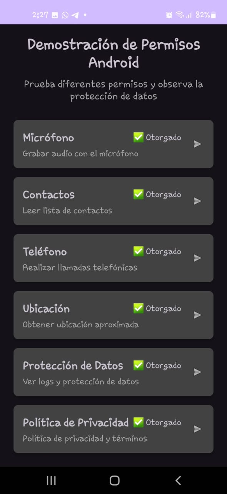

# Desarrollo de Aplicaciones Móviles - Android

Repositorio que contiene los proyectos desarrollados durante el curso de programación Android, organizados por semanas de trabajo.

---

# 📅 Semana 13 - S13_CalculadoraBasica

Una aplicación de calculadora básica desarrollada en Android que permite realizar operaciones matemáticas fundamentales con una interfaz de usuario intuitiva y moderna.

## 📱 Descripción del Proyecto

Esta calculadora básica está diseñada para dispositivos Android y proporciona las funcionalidades esenciales de cálculo que los usuarios necesitan en su día a día. La aplicación implementa el patrón arquitectónico MVVM (Model-View-ViewModel) para garantizar una separación clara de responsabilidades y un código mantenible.

## 🎯 Finalidad

El objetivo principal de este proyecto es:

- Crear una calculadora funcional y fácil de usar para operaciones básicas
- Implementar buenas prácticas de desarrollo Android usando ViewModel  
- Proporcionar una interfaz de usuario limpia y responsive
- Demostrar el uso correcto del patrón MVVM en una aplicación práctica

## ⚡ Funcionalidades

### Operaciones Matemáticas
- ✅ **Suma (+)**: Adición de números
- ✅ **Resta (-)**: Sustracción de números  
- ✅ **Multiplicación (×)**: Producto de números
- ✅ **División (÷)**: División de números

### Funciones de Control
- ✅ **Clear Entry (CE)**: Borra la entrada actual
- ✅ **All Clear (AC)**: Limpia toda la operación
- ✅ **Raíz cuadrada (√)**: Cálculo de raíz cuadrada
- ✅ **Paréntesis ( )**: Soporte para agrupación de operaciones

### Características de Interfaz
- ✅ **Botones grandes**: Fáciles de presionar en dispositivos móviles
- ✅ **Pantalla clara**: Visualización nítida de números y resultados
- ✅ **Diseño responsive**: Adaptación a diferentes tamaños de pantalla
- ✅ **Retroalimentación visual**: Indicación clara de las pulsaciones

## 🏗️ Arquitectura MVVM

El proyecto implementa el patrón **Model-View-ViewModel** siguiendo las mejores prácticas de Android:

### Componentes Principales

| Componente | Archivo | Responsabilidad |
|------------|---------|-----------------|
| **Model** | Lógica interna | Operaciones matemáticas y cálculos |
| **View** | `MainActivity` | Interfaz de usuario y eventos |
| **ViewModel** | `CalculatorViewModel.kt` | Estado de la aplicación y lógica de presentación |

## 📸 Capturas de Pantalla

### Pantalla Principal

> *Interfaz principal mostrando el teclado numérico y operadores con diseño moderno*

### Operación en Progreso  

> *Ejemplo de una operación matemática siendo procesada*

### Resultado Final

> *Pantalla mostrando el resultado calculado de una operación*

## 🛠️ Stack Tecnológico

### Desarrollo
- **Lenguaje**: Kotlin
- **IDE**: Android Studio
- **Arquitectura**: MVVM (Model-View-ViewModel)

### Componentes Android
- **ViewModel**: Gestión del estado de la aplicación
- **LiveData/Observable**: Observación reactiva de datos
- **Data Binding**: Enlace bidireccional entre vista y datos

### Interfaz de Usuario
- **Layouts**: XML con diseño responsive
- **Drawables**: Iconos y fondos personalizados
- **Themes**: Esquema de colores moderno

### Testing
- **JUnit**: Pruebas unitarias
- **Espresso**: Pruebas instrumentadas de UI

---
# 📅 Semana 14 - S14_TechPoint

Aplicación móvil que muestra en un mapa interactivo todos los establecimientos de Chimbote donde se venden equipos de cómputo, con funcionalidad de geolocalización y recomendaciones basadas en proximidad.

## 📱 Descripción del Proyecto

TechPoint es una aplicación de mapas especializada que ayuda a los usuarios a encontrar tiendas de equipos de cómputo en la ciudad de Chimbote. La aplicación utiliza Google Maps para mostrar la ubicación de los establecimientos verificados, detecta la posición actual del usuario y proporciona recomendaciones personalizadas basadas en la distancia.

## 🎯 Finalidad

Los objetivos principales de este proyecto son:

- Crear un directorio digital de tiendas de equipos de cómputo en Chimbote
- Implementar funcionalidades de geolocalización y mapas en Android
- Proporcionar recomendaciones inteligentes basadas en proximidad
- Facilitar la búsqueda y navegación hacia establecimientos especializados
- Demostrar el uso de Google Maps API y servicios de ubicación

## ⚡ Funcionalidades

### Mapa Interactivo
- ✅ **Visualización de Google Maps**: Mapa interactivo de la ciudad de Chimbote
- ✅ **Marcadores personalizados**: Identificación visual de tiendas de tecnología
- ✅ **InfoWindows**: Información detallada de cada establecimiento
- ✅ **Zoom y navegación**: Controles intuitivos para explorar el mapa

### Geolocalización
- ✅ **Detección de ubicación**: GPS del usuario en tiempo real
- ✅ **Cálculo de distancias**: Medición precisa a cada establecimiento
- ✅ **Permisos de ubicación**: Manejo seguro de permisos sensibles
- ✅ **Indicador de posición**: Marcador visual de la ubicación actual

### Sistema de Recomendaciones
- ✅ **Establecimientos cercanos**: Lista ordenada por proximidad
- ✅ **Filtrado inteligente**: Clasificación por tipo de productos
- ✅ **Información de contacto**: Teléfonos, direcciones y horarios
- ✅ **Navegación externa**: Integración con apps de mapas del sistema

### Base de Datos Local
- ✅ **Catálogo verificado**: Información actualizada de establecimientos
- ✅ **Categorización**: Clasificación por especialidad tecnológica
- ✅ **Datos offline**: Funcionalidad básica sin conexión a internet

## 🏗️ Arquitectura y Componentes

El proyecto implementa una arquitectura robusta con integración de servicios de Google:

### Componentes Principales

| Componente | Archivo | Responsabilidad |
|------------|---------|-----------------|
| **MainActivity** | `MainActivity.kt` | Interfaz principal y coordinación |
| **Maps Fragment** | Google Maps API | Visualización del mapa interactivo |
| **Location Service** | FusedLocationProvider | Detección de ubicación GPS |
| **Data Model** | Clases de datos | Estructura de establecimientos |

### APIs y Servicios
- **Google Maps SDK**: Renderizado de mapas y marcadores
- **Location Services**: Geolocalización y permisos
- **Places API**: Información adicional de ubicaciones
- **Geocoding**: Conversión de direcciones a coordenadas

## 📸 Capturas de Pantalla

### Ubicación Actual Detectada

> *Mapa mostrando la ubicación actual del usuario detectada por GPS*

### Establecimientos Cercanos

> *Marcadores de tiendas tecnológicas cercanas a la posición actual*

### Detalle de Establecimiento

> *Información detallada de un establecimiento seleccionado*

### Recomendaciones por Proximidad

> *Establecimientos que tienen el mismo dispositivo pero indica el mas cercano*

## 🛠️ Stack Tecnológico

### Desarrollo
- **Lenguaje**: Kotlin
- **IDE**: Android Studio
- **Arquitectura**: MVVM con Repository Pattern

### Google Services
- **Google Maps SDK**: Mapas interactivos
- **Google Play Services**: Servicios de ubicación
- **Places API**: Información de lugares
- **Directions API**: Cálculo de rutas

### Componentes Android
- **FusedLocationProvider**: Geolocalización eficiente
- **RecyclerView**: Lista de establecimientos
- **CardView**: Diseño de tarjetas informativas
- **Material Design**: Interfaz moderna y consistente

### Permisos y Seguridad
- **ACCESS_FINE_LOCATION**: Ubicación precisa
- **ACCESS_COARSE_LOCATION**: Ubicación aproximada
- **INTERNET**: Conectividad para mapas
- **Runtime Permissions**: Manejo dinámico de permisos

---
# 📅 Semana 15 - S15_Seguridad_Privacidad

Aplicación móvil que implementa un sistema integral de demostración de permisos, protección de datos y técnicas avanzadas de seguridad en Android, utilizando tecnologías modernas como Android Security Crypto, SQLCipher y patrones de arquitectura MVVM.

## 📱 Descripción del Proyecto

S15_Seguridad_Privacidad es una aplicación Android especializada en la demostración práctica de técnicas de seguridad y protección de datos. La aplicación implementa múltiples capas de seguridad incluyendo encriptación AES-256-GCM, gestión segura de permisos, logging auditado y almacenamiento cifrado de datos sensibles. Utiliza SQLCipher para proteger la base de datos local y Android Security Crypto para el manejo seguro de credenciales y información crítica.

## 🎯 Finalidad

Los objetivos principales de este proyecto son:

- **Implementar técnicas avanzadas de encriptación** para proteger datos sensibles en dispositivos móviles
- **Demostrar mejores prácticas de seguridad** en el desarrollo de aplicaciones Android
- **Gestionar permisos de forma segura** y transparente para el usuario
- **Establecer sistemas de auditoría y logging** para el monitoreo de accesos
- **Prevenir vulnerabilidades comunes** en aplicaciones móviles mediante patrones seguros
- **Educar sobre la importancia de la privacidad** y protección de datos en el ecosistema móvil

---

# Evaluación Técnica: Análisis y Mejora de Seguridad en Aplicación Android

## Introducción

Esta evaluación técnica se basa en una aplicación Android que implementa un sistema de demostración de permisos y protección de datos. La aplicación utiliza tecnologías modernas como Kotlin, Android Security Crypto, SQLCipher y patrones de arquitectura MVVM.

## Parte 1: Análisis de Seguridad Básico (0-7 puntos)

### 1.1 Identificación de Vulnerabilidades (2 puntos)

#### ¿Qué método de encriptación se utiliza para proteger datos sensibles?

En el método `loadDataProtectionInfo()`, aparece esta línea:

```kotlin
infoText.append("• Encriptación AES-256-GCM activa\\n")
```

Esto indica que el método de encriptación utilizado es **AES-256-GCM** (Advanced Encryption Standard con modo Galois/Counter Mode).

AES-256-GCM es una técnica moderna, robusta y ampliamente aceptada para proteger datos sensibles, ya que proporciona tanto confidencialidad como integridad (mediante autenticación de los datos).

#### Identifica al menos 2 posibles vulnerabilidades en la implementación actual del logging

Aunque no se muestra la implementación interna del método `logAccess()` del DataProtectionManager, desde el uso que se le da podemos identificar las siguientes vulnerabilidades potenciales:

**a. Falta de control sobre el contenido del log**

Ejemplo:
```kotlin
dataProtectionManager.logAccess("NAVIGATION", "DataProtectionActivity abierta")
```

No se observa ningún filtrado o sanitización del contenido que se está loggeando. Si estas entradas se escriben en archivos accesibles o sin cifrado, podrían revelar patrones de uso o detalles sensibles.

**Impacto:** Información sensible o de comportamiento podría ser accesible a atacantes si los logs no están cifrados o protegidos.

**b. Los logs se actualizan o consultan sin autenticación o permisos adicionales**

Cualquier usuario que abra la actividad puede ver:
```kotlin
binding.tvAccessLogs.text = logsText
```

Esto significa que no hay autenticación previa para ver los registros, lo que permite que cualquier persona con acceso físico al dispositivo pueda visualizar eventos internos de uso de la app.

**Impacto:** Puede facilitar el espionaje de comportamiento del usuario o ingeniería social a través del historial de accesos.

#### ¿Qué sucede si falla la inicialización del sistema de encriptación?

No se muestra en este archivo ningún tipo de manejo de excepciones o verificación del estado del sistema de encriptación. Por ejemplo:

```kotlin
val dataProtectionManager by lazy { 
    (application as PermissionsApplication).dataProtectionManager 
}
```

Esto asume que `dataProtectionManager` ya está inicializado y funcionando correctamente. Si falla su inicialización (por ejemplo, si hay un error en la configuración del cifrado, una clave corrupta o incompatibilidad con el dispositivo), podrían ocurrir los siguientes problemas:

- La aplicación puede cerrarse (crash) debido a una excepción no controlada
- Los datos sensibles podrían quedar sin protección si el fallback omite la encriptación (esto depende de la implementación interna que no se muestra aquí)
- Los logs podrían no registrarse, lo que afectaría la trazabilidad

**Recomendación:** Se recomienda incluir bloqueos try-catch o comprobaciones como:

```kotlin
if (dataProtectionManager.isInitialized()) { 
    ... 
} else { 
    showError("Sistema de protección no disponible") 
}
```

### 1.2 Permisos y Manifiesto (2 puntos)

#### Lista todos los permisos peligrosos declarados en el manifiesto

Los **permisos peligrosos** en Android son aquellos que permiten acceder a información sensible o controlar funcionalidades críticas del dispositivo.

En el `AndroidManifest.xml`, se han declarado los siguientes permisos peligrosos:

| Permiso | Categoría |
|---------|-----------|
| `android.permission.CAMERA` | Cámara |
| `android.permission.READ_EXTERNAL_STORAGE` | Almacenamiento (API < 33) |
| `android.permission.READ_MEDIA_IMAGES` | Archivos multimedia (API 33+) |
| `android.permission.RECORD_AUDIO` | Micrófono |
| `android.permission.READ_CONTACTS` | Contactos |
| `android.permission.CALL_PHONE` | Teléfono |
| `android.permission.SEND_SMS` | SMS |
| `android.permission.ACCESS_COARSE_LOCATION` | Ubicación aproximada |

⚠️ **Nota:** `android.permission.ACCESS_NETWORK_STATE` **no es peligroso** (es de nivel normal).

#### ¿Qué patrón se utiliza para solicitar permisos en runtime?

En `MainActivity.kt` se está utilizando el **patrón moderno basado en `ActivityResultContracts`** para pedir permisos en tiempo de ejecución.

Fragmento relevante:

```kotlin
private val requestPermissionLauncher = registerForActivityResult(
    ActivityResultContracts.RequestPermission()
) { isGranted -> ... }
```

Esto corresponde al enfoque **recomendado por Google** para Android 11+ y versiones futuras, en lugar del método antiguo `requestPermissions()`.

Este patrón tiene las siguientes ventajas:

- Evita el uso manual del código de respuesta `onRequestPermissionsResult()`
- Encapsula la lógica de petición de permisos de forma más segura y clara
- Es compatible con el ciclo de vida de la actividad o fragmento

#### Identifica qué configuración de seguridad previene backups automáticos

En el bloque `<application>`, aparece esta línea:

```xml
android:allowBackup="false"
```

Esta configuración **desactiva las copias de seguridad automáticas** de los datos de la aplicación a servicios como Google Drive.

Esto es importante para aplicaciones que manejan datos sensibles o privados, ya que evita que se almacenen en la nube sin el conocimiento o control del usuario.

⚠️ También se incluye:

```xml
android:fullBackupContent="@xml/backup_rules"
```

Esto **define reglas personalizadas**, pero al tener `allowBackup="false"`, **no se aplica** porque la funcionalidad completa está desactivada.

### 1.3 Gestión de Archivos (3 puntos)

#### ¿Cómo se implementa la compartición segura de archivos de imágenes?

La compartición segura se realiza utilizando `FileProvider`, un componente que permite a la app **compartir archivos entre apps** utilizando **URIs seguras (content://)** en lugar de URIs inseguras (`file://`).

**Proceso implementado en `CameraActivity.kt`:**

1. **Se crea un archivo de imagen** en un directorio privado:
```kotlin
val photoFile = createImageFile()
```

2. **Se obtiene una URI segura con `FileProvider`:**
```kotlin
currentPhotoUri = FileProvider.getUriForFile(
    this,
    "com.example.seguridad_priv_a.fileprovider", // autoridad declarada
    photoFile
)
```

3. **Se lanza la cámara con esa URI usando `ActivityResultContracts.TakePicture()`:**
```kotlin
takePictureLauncher.launch(uri)
```

4. **La imagen se muestra y almacena la URI de forma segura:**
```kotlin
binding.ivCameraPreview.setImageURI(uri)
dataProtectionManager.storeSecureData("last_photo_path", photoPath)
```

⚠️ Esta implementación **evita exponer rutas de archivos reales** y **aplica controles de acceso**, lo que protege la app y al sistema operativo.

#### ¿Qué autoridad se utiliza para el FileProvider?

La autoridad utilizada es:

```kotlin
"com.example.seguridad_priv_a.fileprovider"
```

Esta autoridad está **declarada en el AndroidManifest.xml:**

```xml
<provider
    android:name="androidx.core.content.FileProvider"
    android:authorities="com.example.seguridad_priv_a.fileprovider"
    android:exported="false"
    android:grantUriPermissions="true">
    <meta-data
        android:name="android.support.FILE_PROVIDER_PATHS"
        android:resource="@xml/file_paths" />
</provider>
```

Y está **vinculada al archivo `file_paths.xml`**, donde se definen los directorios accesibles:

```xml
<external-files-path name="my_images" path="Pictures" />
<external-files-path name="my_audio" path="Audio" />
```

Esto significa que los archivos ubicados dentro de `/Android/data/[paquete]/files/Pictures/` o `/Audio/` podrán ser compartidos **mediante URIs `content://` protegidas**.

#### Explica por qué no se debe usar file:// URIs directamente

Usar URIs del tipo `file://` directamente está **prohibido a partir de Android 7.0 (API 24)** debido a razones de **seguridad y privacidad**.

**Motivos principales:**

| Problema | Explicación |
|----------|-------------|
| ❌ **File exposure vulnerability** | Las `file://` URIs exponen directamente la ruta real en el sistema de archivos, lo que permite a apps externas acceder sin restricciones |
| ❌ **Falta de control de acceso** | No hay verificación de permisos ni aislamiento de procesos: una app maliciosa podría acceder al archivo |
| ❌ **Crash en apps receptoras (FileUriExposedException)** | Desde Android 7.0, si se pasa una URI `file://` a otra app, el sistema lanza una **excepción y detiene la app** |

**Solución segura:**

Usar `FileProvider` que:
- Genera URIs tipo `content://` (por ejemplo, `content://com.example.seguridad_priv_a.fileprovider/my_images/filename.jpg`)
- **Otorga permisos temporales** mediante `grantUriPermissions=true`
- **Encapsula el acceso** evitando exponer rutas del sistema
---
## Parte 2: Implementación y Mejoras Intermedias (8-14 puntos)

### 2.1 Fortalecimiento de la Encriptación (3 puntos)

**Descripción:** Sistema avanzado de gestión criptográfica que implementa rotación automática de claves, verificación de integridad y derivación segura de claves para proteger datos sensibles a largo plazo.

**Funcionalidades:**
- **Rotación automática de claves maestras cada 30 días:** Previene el uso prolongado de claves comprometidas y mejora la seguridad temporal
- **Verificación de integridad usando HMAC:** Detecta modificaciones no autorizadas en datos encriptados mediante códigos de autenticación
- **Key derivation con salt único por usuario:** Genera claves específicas derivadas de una clave maestra usando salt criptográfico único
- **Gestión de ciclo de vida de claves:** Control completo sobre creación, uso, rotación y destrucción segura de material criptográfico

```kotlin
// Ejemplo de estructura esperada
fun rotateEncryptionKey(): Boolean {
    // Tu implementación aquí
}
fun verifyDataIntegrity(key: String): Boolean {
    // Tu implementación aquí
}
```

### 2.2 Sistema de Auditoría Avanzado (3 puntos)

**Descripción:** Framework integral de monitoreo y análisis de seguridad que detecta patrones anómalos, implementa controles de acceso temporal y mantiene trazabilidad completa de eventos críticos.

**Funcionalidades:**
- **Detección de accesos sospechosos:** Algoritmos de análisis comportamental que identifican patrones de acceso inusuales o maliciosos
- **Rate limiting inteligente:** Control dinámico de frecuencia de operaciones sensibles basado en contexto y riesgo
- **Sistema de alertas en tiempo real:** Notificaciones inmediatas cuando se detectan anomalías o violaciones de seguridad
- **Exportación de logs firmados:** Generación de registros en formato JSON con firma digital para garantizar autenticidad e integridad

### 2.3 Biometría y Autenticación (3 puntos)

**Descripción:** Sistema multicapa de autenticación que combina biometría moderna con métodos de respaldo tradicionales, implementando gestión inteligente de sesiones y timeouts de seguridad.

**Funcionalidades:**
- **Autenticación biométrica nativa:** Integración con BiometricPrompt API para huella dactilar, reconocimiento facial y otros métodos biométricos
- **Fallback automático a PIN/Pattern:** Sistema de respaldo cuando la biometría no está disponible o falla la autenticación
- **Gestión de sesiones con timeout:** Control automático de inactividad con cierre de sesión tras 5 minutos sin actividad
- **Protección de datos sensibles:** Bloqueo de acceso a logs y información crítica sin autenticación previa

## Parte 3: Arquitectura de Seguridad Avanzada (15-20 puntos)

### 3.1 Implementación de Zero-Trust Architecture (3 puntos)

**Descripción:** Arquitectura de seguridad basada en el principio "nunca confíes, siempre verifica", donde cada operación es validada independientemente sin asumir confianza implícita en ningún componente.

**Funcionalidades:**
- **Validación continua de operaciones:** Cada acción sensible requiere verificación individual sin depender de autenticaciones previas
- **Principio de menor privilegio contextual:** Asignación dinámica de permisos mínimos necesarios según el contexto específico de cada operación
- **Gestión de tokens temporales:** Sistema de sesiones con tokens de corta duración que expiran automáticamente
- **Attestation de integridad:** Verificación continua de que la aplicación no ha sido modificada o comprometida

### 3.2 Protección Contra Ingeniería Inversa (3 puntos)

**Descripción:** Suite completa de técnicas defensivas para proteger la aplicación contra análisis, modificación y ataques de ingeniería inversa, manteniendo la integridad del código y las comunicaciones.

**Funcionalidades:**
- **Detección de debugging y emulación:** Identificación en tiempo real de herramientas de debugging, emuladores y entornos de análisis
- **Obfuscación avanzada de código:** Transformación de strings sensibles y constantes criptográficas para dificultar el análisis estático
- **Verificación de firma digital runtime:** Validación continua de que la aplicación mantiene su firma original y no ha sido modificada
- **Certificate pinning robusto:** Implementación de fijación de certificados para prevenir ataques man-in-the-middle en comunicaciones futuras

### 3.3 Framework de Anonimización Avanzado (2 puntos)

**Descripción:** Sistema sofisticado de protección de privacidad que implementa técnicas matemáticas avanzadas para anonimizar datos mientras preserva su utilidad analítica y cumple con regulaciones de privacidad.

**Funcionalidades:**
- **Algoritmos k-anonimity y l-diversity:** Técnicas de generalización y supresión que garantizan que cada registro sea indistinguible de al menos k-1 otros registros
- **Differential privacy para datos numéricos:** Introducción de ruido calibrado matemáticamente para proteger la privacidad individual mientras preserva tendencias estadísticas
- **Data masking específico por tipo:** Técnicas de enmascaramiento adaptadas al tipo de dato (nombres, direcciones, números, etc.)
- **Políticas de retención configurables:** Sistema flexible de reglas para determinar cuánto tiempo mantener datos y cuándo aplicar anonimización

```kotlin
class AdvancedAnonymizer {
    fun anonymizeWithKAnonymity(data: List<PersonalData>, k: Int): List<AnonymizedData>
    fun applyDifferentialPrivacy(data: NumericData, epsilon: Double): NumericData
    fun maskByDataType(data: Any, maskingPolicy: MaskingPolicy): Any
}
```

### 3.4 Análisis Forense y Compliance (2 puntos)

**Descripción:** Plataforma integral de investigación digital y cumplimiento regulatorio que mantiene evidencia digital íntegra, genera reportes automáticos y facilita investigaciones de incidentes de seguridad.

**Funcionalidades:**
- **Chain of custody digital:** Mantenimiento de cadena de custodia criptográfica para evidencias digitales con timestamps y hashes verificables
- **Logs tamper-evident con blockchain:** Implementación de blockchain local para crear registros inmutables que detectan cualquier intento de modificación
- **Generación automática de reportes GDPR/CCPA:** Sistema que produce automáticamente documentación de cumplimiento para regulaciones de privacidad
- **Herramientas de investigación de incidentes:** Suite de utilidades para análisis forense, correlación de eventos y reconstrucción de actividades maliciosas


## 🖼️ Capturas de Pantalla

### Demostración del Sistema de Permisos de Android

> *Captura de pantalla mostrando la solicitud y gestión de permisos peligrosos en la aplicación*

