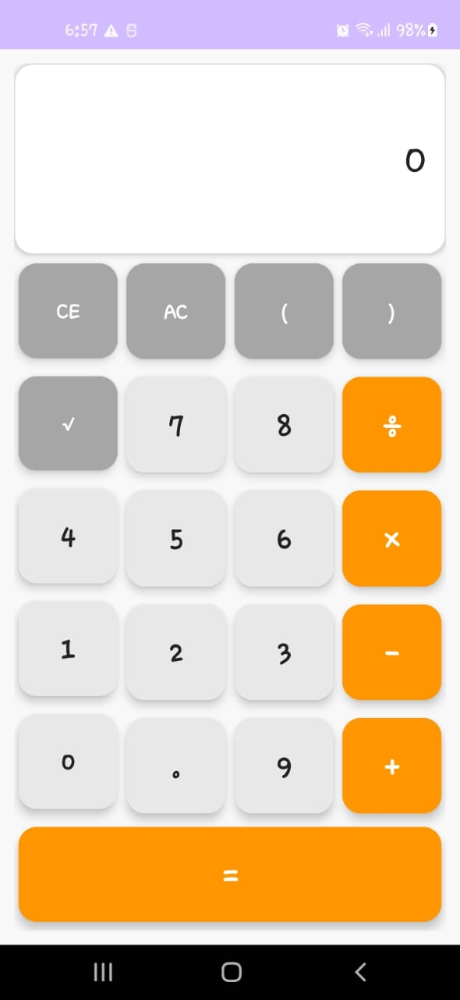
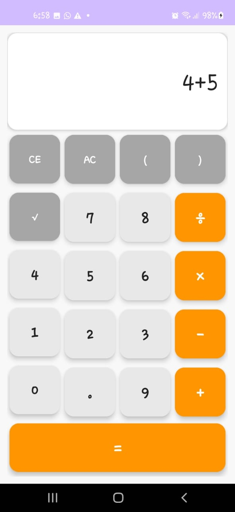
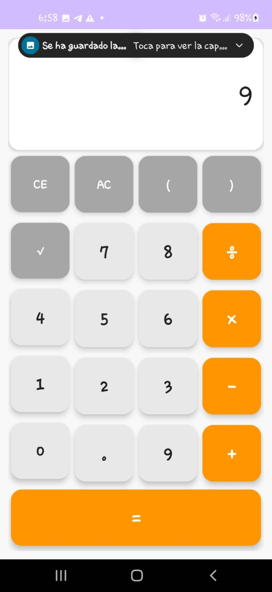

# Desarrollo de Aplicaciones Móviles - Android

Repositorio que contiene los proyectos desarrollados durante el curso de programación Android, organizados por semanas de trabajo.

---

# 📅 Semana 13 - S13_CalculadoraBasica

Una aplicación de calculadora básica desarrollada en Android que permite realizar operaciones matemáticas fundamentales con una interfaz de usuario intuitiva y moderna.

## 📱 Descripción del Proyecto

Esta calculadora básica está diseñada para dispositivos Android y proporciona las funcionalidades esenciales de cálculo que los usuarios necesitan en su día a día. La aplicación implementa el patrón arquitectónico MVVM (Model-View-ViewModel) para garantizar una separación clara de responsabilidades y un código mantenible.

## 🎯 Finalidad

El objetivo principal de este proyecto es:

- Crear una calculadora funcional y fácil de usar para operaciones básicas
- Implementar buenas prácticas de desarrollo Android usando ViewModel  
- Proporcionar una interfaz de usuario limpia y responsive
- Demostrar el uso correcto del patrón MVVM en una aplicación práctica

## ⚡ Funcionalidades

### Operaciones Matemáticas
- ✅ **Suma (+)**: Adición de números
- ✅ **Resta (-)**: Sustracción de números  
- ✅ **Multiplicación (×)**: Producto de números
- ✅ **División (÷)**: División de números

### Funciones de Control
- ✅ **Clear Entry (CE)**: Borra la entrada actual
- ✅ **All Clear (AC)**: Limpia toda la operación
- ✅ **Raíz cuadrada (√)**: Cálculo de raíz cuadrada
- ✅ **Paréntesis ( )**: Soporte para agrupación de operaciones

### Características de Interfaz
- ✅ **Botones grandes**: Fáciles de presionar en dispositivos móviles
- ✅ **Pantalla clara**: Visualización nítida de números y resultados
- ✅ **Diseño responsive**: Adaptación a diferentes tamaños de pantalla
- ✅ **Retroalimentación visual**: Indicación clara de las pulsaciones

## 🏗️ Arquitectura MVVM

El proyecto implementa el patrón **Model-View-ViewModel** siguiendo las mejores prácticas de Android:

### Componentes Principales

| Componente | Archivo | Responsabilidad |
|------------|---------|-----------------|
| **Model** | Lógica interna | Operaciones matemáticas y cálculos |
| **View** | `MainActivity` | Interfaz de usuario y eventos |
| **ViewModel** | `CalculatorViewModel.kt` | Estado de la aplicación y lógica de presentación |

## 📸 Capturas de Pantalla

### Pantalla Principal

> *Interfaz principal mostrando el teclado numérico y operadores con diseño moderno*

### Operación en Progreso  

> *Ejemplo de una operación matemática siendo procesada*

### Resultado Final

> *Pantalla mostrando el resultado calculado de una operación*

## 🛠️ Stack Tecnológico

### Desarrollo
- **Lenguaje**: Kotlin
- **IDE**: Android Studio
- **Arquitectura**: MVVM (Model-View-ViewModel)

### Componentes Android
- **ViewModel**: Gestión del estado de la aplicación
- **LiveData/Observable**: Observación reactiva de datos
- **Data Binding**: Enlace bidireccional entre vista y datos

### Interfaz de Usuario
- **Layouts**: XML con diseño responsive
- **Drawables**: Iconos y fondos personalizados
- **Themes**: Esquema de colores moderno

### Testing
- **JUnit**: Pruebas unitarias
- **Espresso**: Pruebas instrumentadas de UI

---
